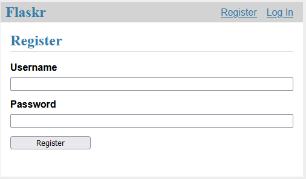
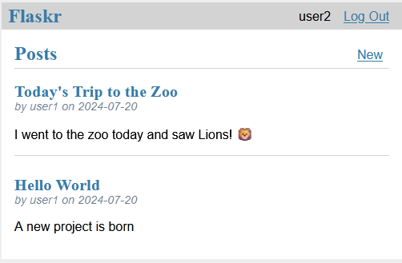
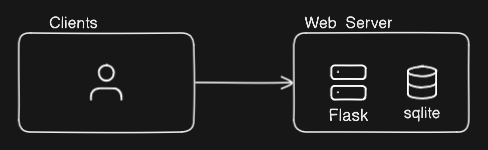

# Pyflask-tutorial

## Goal

My goal with this project is to learn more about backend system design by starting with the base project provided by the Python flask docs (https://flask.palletsprojects.com/en/3.0.x/tutorial/) and expanding it.

## Base Project

The base project is a simple forum-style application that allows users to make posts. The current features are:

- Login/Register users
- Create posts
- Edit posts
- Delete posts
- View all posts

Here are a few screenshots (This is definitely not a frontend project):

|  |
| :--: |
| _A basic registration page_ |

|  |
| :--: |
| _The main page showcasing the feed of posts_ |

Currently, this is a monolithic architecture, since it uses a local sqlite instance running on the same server as the web application.

Here is a current snapshot of the application, which I will continue to update as more components are added:

## 